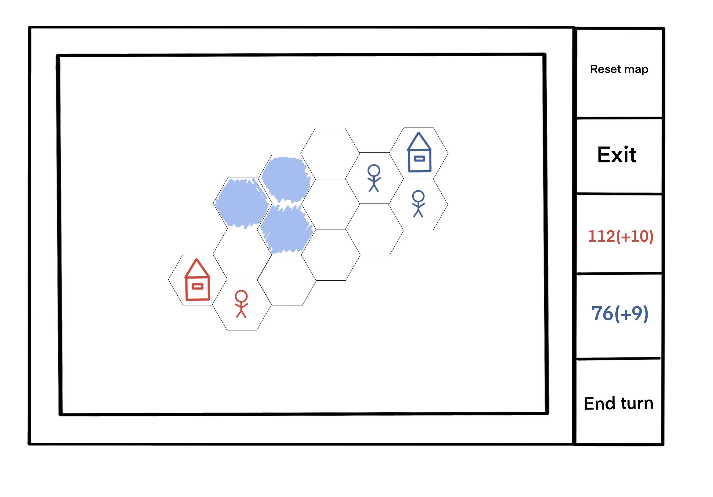

1) Постановка задачи: 
Создать скелет пошаговой 4x стратегии и позже дополнить его произвольными элементами в зависимости от пожеланий участников разработки.
2) Интерфейсная модель (!!СКЕЛЕТА!!):
	- в приложении существует одно окно.
	- окно поделено на фрейм с картой стратегии слева и на колонку с интерактивными
	виджетами справа.
	- Виджеты справа следующие:
		- "Reset Map": нажатие на виджет-кнопку возвращает карту и баланс игроков к изначальным состояниям.
		- "Exit": нажатие на виджет-кнопку выходит из приложения.
		- "BalanceRed": виджет показывает казну и доход в ход красного игрока.
		- "BalanceBlue": виджет показывает казну и доход в ход синего игрока.
		- "EndTurn": нажатие на виджет-кнопку передает ход другому игроку.
	- В окне слева содержится карта стратегии, представленная из шестиугольников ("гексов"). Моделирование территорий
	производится с помощью них.
	- Гексы делятся на "сушу" и "море".
	- На карте расположено 2 генерирующих доход "домика" - красный и синий.
	- При нажатии на гекс с домиком вылезает окошко с выбором юнита для покупки и ценой его найма(содержания в ход).
	- В скелете поддерживается один юнит (характеристики и тип взаимодействия юнитов и "домиков" уточняется)
	- Ход начинается с красного игрока.
	- победа - уничтожение вражеского домика, после чего игра возвращается к исходному состоянию.
3) Примеры возможных "TODO" к проекту:
	- Создание ИИ для одиночной игры (например, деревьями решений)
	- Создание механизма генерации карт (на примере эвристик)
	- Добавление различных по механике юнитов и новых характеристик для этих юнитов
	- Увеличение типов гексов + добавление им особенных свойств.
	- Усложнение экономики, деление единого "золота" на ресурсы.
	- Комплексное "покрасивше" оформление всего внешнего интерфейса.
	- Добавление различных "реалистичных" механик типа научного/культурного развития.

P.S. Все еще будет уточняться. Демонстрационная картинка интерфейса скелета:

  

